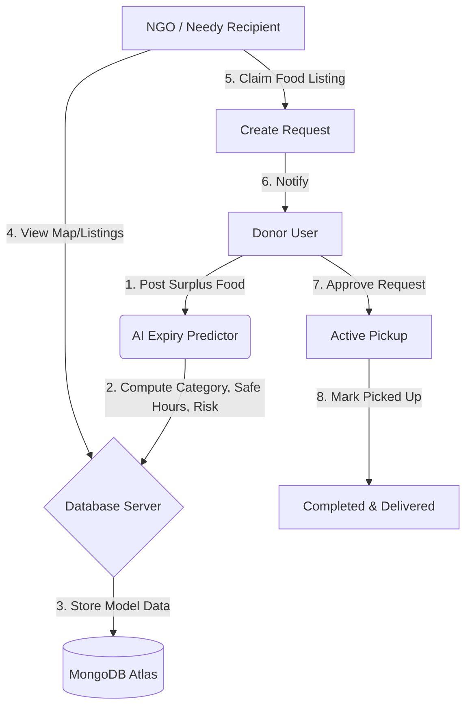

# 🍲 RescueMeal: AI-Assisted Surplus Food Donation Platform

[](https://react.dev/)
[](https://nodejs.org/)
[](https://www.mongodb.com/)
[](https://tailwindcss.com/)
[](https://vercel.com/)

RescueMeal is a state-of-the-art surplus food donation platform built using the MERN stack. It bridges the gap between food donors (restaurants, caterers, supermarkets, and individuals) and recipients (NGOs, community centers, and individuals in need).

By integrating a custom deterministic **AI Expiry Predictor**, the platform ensures food safety compliance by dynamically calculating remaining shelf life based on cooked time, storage temperature, and food type before donations can be claimed.

---

## 🔗 Project Links

*   **Live Frontend URL:** [https://rescuemeal-frontend.vercel.app](https://rescuemeal-frontend.vercel.app)
*   **Demo Accounts (for evaluation):**
    *   **Donor:** `donor@example.com` (Password: `password123`)
    *   **NGO:** `ngo@example.com` (Password: `password123`)
    *   **Needy Person:** `needy@example.com` (Password: `password123`)

---

## 💡 Key Features

### 🤵 Dual-Persona and Multi-Role Dashboards
RescueMeal adapts its interface dynamically according to user roles:
*   **Donor Dashboard:**
    *   List food items instantly with quantity and cooked time.
    *   Get real-time feedback from the AI Expiry Predictor during entry.
    *   Upload images of the food (local fallback or cloud-hosted via Cloudinary).
    *   Review recipient requests and approve/reject claims.
    *   Mark pickup packages as officially "Delivered".
*   **NGO Dashboard:**
    *   Explore real-time listings of available food nearby.
    *   Review remaining safe hours and safety risk warnings.
    *   Claim surplus listings to feed community shelters.
    *   Track active pickups and delivery logs.
*   **Needy Person Dashboard:**
    *   Minimalist, lightweight dashboard tailored for direct aid.
    *   Request specific food items with a single click.

### 🧠 Dynamic AI Expiry Predictor (FDA-Inspired Guidelines)
To prevent foodborne illnesses, RescueMeal implements a keyword-based natural language processing classifier on the backend and frontend.
*   **Categorization:** Automatically parses titles to recognize categories such as **Biryani**, **Rice**, **Curry**, **Snacks**, and **Generic**.
*   **Storage Modifiers:** Modifies remaining life based on:
    *   *Room Temperature* (e.g., 4-8 hours)
    *   *Refrigerated* (e.g., 18-24 hours)
    *   *Frozen* (e.g., 72 hours)
*   **Real-time Risk Engine:** Computes elapsed time since cooking and displays visual safety levels (`Low`, `Medium`, `High` risk) dynamically.

### 🌗 Premium Visual Design
*   Includes full dark mode and light mode theme toggles with smooth transitions.
*   Interactive UI animations and cards built with Tailwind CSS.
*   Beautiful modern icons powered by Lucide React.

---

## 🏗️ System Architecture & Workflow



---

## 🛠️ Technology Stack

| Layer | Technology | Purpose |
| :--- | :--- | :--- |
| **Frontend** | React (Vite) | High-performance, fast-refresh SPA framework. |
| **Styling** | Tailwind CSS | Utility-first styling for rich responsive layouts. |
| **Icons** | Lucide React | Clean, scalable visual assets. |
| **State/API**| Axios + Context API | Global authentication state and server sync. |
| **Backend** | Node.js + Express | REST API, route handlers, middleware. |
| **Database** | MongoDB + Mongoose | Schema definitions and relationship mapping. |
| **Uploads** | Cloudinary / Multer | Dynamic image processing with local fallback. |
| **Security** | JWT + BcryptJS | Secure JSON Web Tokens and password hashing. |

---

## 📁 Repository Structure

```text
rescuemeal/
├── backend/
│   ├── config/             # DB configurations
│   ├── controllers/        # Express handlers (auth, donation, request)
│   ├── middleware/         # Auth guards, multer upload processors
│   ├── models/             # Mongoose schemas (User, Donation, Request)
│   ├── routes/             # API Router endpoints
│   ├── uploads/            # Temporary/fallback local media store
│   ├── .env.example        # Reference environment variables
│   ├── server.js           # Server bootstrapper & configuration
│   └── vercel.json         # Vercel serverless deployment setup
├── frontend/
│   ├── public/             # Static public assets
│   ├── src/
│   │   ├── assets/         # App styles and icons
│   │   ├── components/     # Reusable layout and theme wrappers
│   │   ├── context/        # Authentication & State management
│   │   ├── pages/          # Layout templates (Dashboard, PostDonation, etc.)
│   │   ├── utils/          # Axios instance configurations
│   │   ├── App.jsx         # Client routing
│   │   └── main.jsx        # Client entry point
│   ├── tailwind.config.js  # Styling themes and fonts
│   └── vite.config.js      # Build bundler configurations
└── README.md               # Main Documentation
```

---

## ⚙️ Configuration & Environment Variables

### Backend Configuration
Create a `.env` file inside the `backend/` directory using the following template:

```env
PORT=5000
MONGODB_URI=mongodb://localhost:27017/rescuemeal
JWT_SECRET=your_jwt_secret_here

# Optional: Cloudinary Cloud Hosting (For image uploads)
CLOUDINARY_CLOUD_NAME=your_cloudinary_cloud_name
CLOUDINARY_API_KEY=your_cloudinary_api_key
CLOUDINARY_API_SECRET=your_cloudinary_api_secret
```

> [!NOTE]
> If Cloudinary credentials are left empty, the backend automatically falls back to local storage inside the `backend/uploads/` directory.

### Frontend Configuration
Create a `.env` file inside the `frontend/` directory:

```env
VITE_API_URL=http://localhost:5000/api
```

---

## 🚀 How to Run Locally

### Prerequisites
*   [Node.js](https://nodejs.org/) installed (v16+ recommended).
*   [MongoDB Community Server](https://www.mongodb.com/try/download/community) running locally on port `27017`.

### 1. Launch the Backend API
```bash
cd backend
npm install
npm start
```
*The server will start running on port `5000` (or your defined `PORT`).*

### 2. Launch the Frontend Development Client
```bash
cd frontend
npm install --legacy-peer-deps
npm run dev
```
*The dev client will boot on [http://localhost:5173](http://localhost:5173).*

---

## 🔌 API Documentation Reference

### Authentication Endpoints
| HTTP Method | Route | Auth Required | Description |
| :--- | :--- | :---: | :--- |
| `POST` | `/api/auth/register` | No | Registers a new user (Donor, NGO, or Needy). |
| `POST` | `/api/auth/login` | No | Returns user credentials and JWT bearer token. |
| `GET` | `/api/auth/me` | Yes | Retrieves current user profile details. |

### Donation Endpoints
| HTTP Method | Route | Auth Required | Roles Permitted | Description |
| :--- | :--- | :---: | :---: | :--- |
| `POST` | `/api/donations` | Yes | Donor | Post a new food donation (supports image upload). |
| `GET` | `/api/donations` | Yes | All | Fetch all active food donations. |
| `GET` | `/api/donations/my-donations` | Yes | Donor | Get all listings posted by current donor. |
| `GET` | `/api/donations/:id` | Yes | All | Get detailed information for a single donation. |
| `PUT` | `/api/donations/:id/claim` | Yes | NGO | Claims a donation immediately (without approvals). |
| `PUT` | `/api/donations/:id/deliver` | Yes | Donor / NGO | Mark a claimed donation as delivered. |

### Claim & Request Endpoints
| HTTP Method | Route | Auth Required | Roles Permitted | Description |
| :--- | :--- | :---: | :---: | :--- |
| `POST` | `/api/requests` | Yes | NGO / Needy | Request access to a donation listing. |
| `GET` | `/api/requests/my-requests` | Yes | NGO / Needy | View status of requests submitted by current user. |
| `GET` | `/api/requests/donation/:donationId` | Yes | Donor | View all incoming recipient requests for a donation. |
| `PUT` | `/api/requests/:id/status` | Yes | Donor | Approve or reject a recipient's request. |

---

## 💡 AI Expiry Predictor Logic Specifications

The prediction safety algorithm works deterministically as follows:

1.  **Keyword Parsing:** We match the food name against keyword arrays:
    *   `['biryani']` ➡️ **Biryani** (98% confidence)
    *   `['rice', 'pulao', 'pulav', 'jeera rice']` ➡️ **Rice** (92% confidence)
    *   `['curry', 'dal', 'gravy', 'sambar', 'paneer', 'chicken', 'sabzi', 'korma']` ➡️ **Curry** (90% confidence)
    *   `['snack', 'samosa', 'pakora', 'sandwich', 'burger', 'chips', 'rolls']` ➡️ **Snacks** (94% confidence)
    *   *No match* ➡️ **Generic** (75% confidence)

2.  **Safety Hour Assignment:**
    | Food Type | Room Temperature | Refrigerated | Frozen |
    | :--- | :---: | :---: | :---: |
    | **Biryani** | 6 hrs | 24 hrs | 72 hrs |
    | **Rice** | 6 hrs | 24 hrs | 72 hrs |
    | **Curry** | 4 hrs | 18 hrs | 72 hrs |
    | **Snacks** | 8 hrs | 24 hrs | 72 hrs |
    | **Generic** | 6 hrs | 20 hrs | 72 hrs |

3.  **Risk Calculations:**
    *   `Remaining Safe Hours` = `Safe Duration` - `Elapsed hours since Cooked Time`.
    *   If `Remaining Safe Hours <= 2` ➡️ **High Risk** (Displays red warning flags).
    *   If `Remaining Safe Hours <= 40% of initial Safe Duration` ➡️ **Medium Risk** (Displays amber caution flags).
    *   Otherwise ➡️ **Low Risk** (Displays green safety badges).

---

## 🗺️ Roadmap & Future Scope
*   **Google Maps Distance Matrix Integration:** Auto-calculate route vectors and estimated travel times for NGO pick-ups.
*   **Web Push and SMS Alerts (Twilio):** Trigger instant mobile text messages to local NGOs the moment a donation is posted.
*   **Donor Gamification & Leaderboard:** Reward donors with badges, impact points, and public recognition metrics.
*   **Real-time WebSocket Chat:** Let Donors and NGOs message each other directly to coordinate pick-up times.
